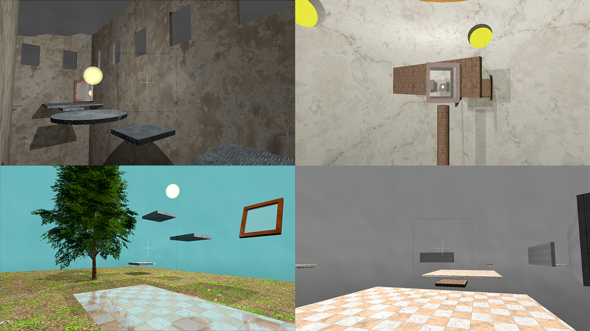
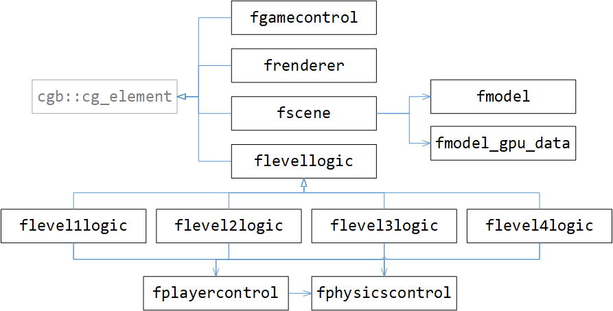

# Focus - A Puzzle Game based on Real-Time Ray Tracing

_Focus_ uses Real-Time Ray Tracing (or NVIDIA RTX) not only for rendering the entire scene. It also features innovative usage of Real-Time Ray Tracing for its gameplay by tracing the player's view rays in order to detect if they hit the _Focussphere_, focussing on which the player's goal is.

## About the Game
This game uses Real-Time Ray Tracing for gameplay mechanics. A graphics card supporting Real-Time Ray Tracing, such as models from the NVIDIA RTX series, is therefore necessary to play the game. Inside each level, there is a shiny yellow sphere -- the so called _Focusphere_ -- that brightens up the sky when the player looks at it. You win the level, if you stand on the goal platform (recognizable by its beige color) and look at the sphere until the sky reaches its maximum brightness. Sometimes it's not possible to look at the sphere directly from the goal platform, so you need to use rotatable mirrors in the level to look at the sphere.

Controls:
* WASD + Mouse Movement: Move around
* Space: Jump
* Left Click: Interact with mirrors
* Tab: Pause game
* Esc: Exit game
* F10: Skip level

## Technical Overview
This game is based on the framework [cg_base](https://github.com/cg-tuwien/cg_base) using Vulkan as the underlying graphics API. One of the main concepts of _cg\_base_ is composition, which capsules several `cg_element`s, which define the behaviour of different components of the game. Each `cg_element` has own methods for initializing, updating, rendering etc., which are called automatically by the framework. This game uses four `cg_element`-derived classes, which are:
* [fgamecontrol](source_code/fgamecontrol.h): Manages the game on a high level. Creates other `cg_element` instances and is responsible for changing the levels, as well as pausing and stopping the game.
* [flevellogic](source_code/flevellogic.h): Describes the mechanics of a level. Animates the objects, moves the player, and checks for win/loose-conditions. Each level has its own subclass. Classes such as [fplayercontrol](source_code/fplayercontrol.h) and [fphysicscontroller](source_code/fphysicscontroller.h) help simplyfing the code of these classes.
* [fscene](source_code/fscene.h): Capsules all the scene objects of a level. Also creates and manages the GPU buffers and ray tracing acceleration structures, which are updated, when objects in the scene change.
* [frenderer](source_code/frenderer.h): Responsible for starting the rendering process and initializing all the necessary data that is needed for that, such as descriptor sets and command buffers.

Note that in a classical rasterization based game, you could create an own `cg_element` for each scene object with its own render-function. In a ray tracing based game however, this is not really an option, as there is only one top level acceleration structure for the entire scene, which has to be passed to the ray generation shader once as a whole.

An important aspect of Vulkan is that we have several frames in flight, where the next frame might be started to be processed, while the last one is not entirely finished. For this reason, all scene data that might change during the game has to be stored several times on the GPU, once for each frame, such that updates of the data only affect the next frames, and no frames which are already being processed.

The core gameplay mechanic of this game is the brightening of the sky when player looks at the _Focussphere_ (directly or through a mirror). To do this, we store a payload object of type `RayTracingHit` inside the shaders while recursing through the reflections. This object contains various informations, such as the color, information about transparent objects along the ray and some other info, among which is the information whether the ray has hit the _Focussphere_. This variable is set in the Any-Hit shader (as the sphere is a transparent object) and is eventually passed on to the parent of the current ray tracing call. The Ray Generation shader, which creates one ray per pixel, is then able to check this property for each ray. It sums up the amount of pixels inside the central screen region using the function `atomicAdd` on a shader storage buffer object (SSBO). Inside the `frenderer` class, the value inside the SSBO is then read and reset. It is divided by the size of the screen to get a screen size independent value describing how much of the sphere is inside the central region of the screen. As we have several frames in flight, we can only read the value for the current frame a few frames later. The delay for reading this value back to the CPU-side depends on the number of frames in flight, which is configurable in _cg\_base_.

## Installation

Follow these steps:    
1. Clone the repository
2. Update the git submodules (command: `git submodule update --init`)
3. Open [`visual_studio/focus_rt.sln`](./visual_studio/the_game) with Visual Studio 2019
4. Select `focus_rt` as startup project.
5. Make sure that a Vulkan configuration is selected
6. Build
7. Run

Detailed information about project setup and resource management with Visual Studio are given in [`cg_base/visual_studio/README.md`](https://github.com/cg-tuwien/cg_base/tree/master/visual_studio/README.md).
